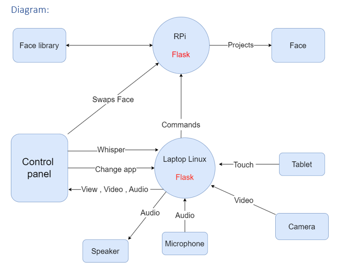
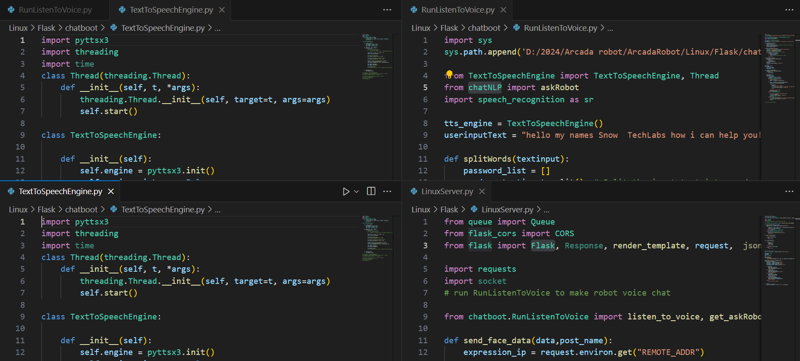
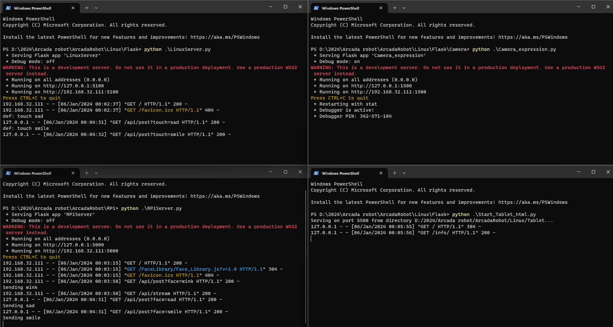

# Advanced-AI-Robot-System
In this AI-powered robot app, we've developed a chatbot application using various technologies such as: In Python. 

## How the App Works:

### Our AI-powered robot app operates through a sophisticated chatbot application that integrates cutting-edge technologies. Here's a breakdown of its functionality:

1. Natural Language Processing (NLP):
- The app leverages NLP to understand and interpret human language, enabling the chatbot to comprehend user input accurately.

2. DeepFace:
- DeepFace technology is employed for facial recognition, allowing the chatbot to analyze and interpret facial expressions during interactions.

3. Queue, CORS, spacy, chatNLP, pyttsx3, Threading:
- Various technologies, including Queue, CORS, spacy, chatNLP, pyttsx3, and threading, are incorporated to optimize the app's performance and enhance the user experience.

4. Flask, WebSocket, socketserver:
- Flask, WebSocket, and socketserver ensure efficient communication and data exchange between the chatbot and the user interface.

5. OS:
- The app utilizes the operating system (OS) to manage system resources and execute tasks seamlessly.

6. Human-like Communication:
- With its comprehensive set of tools, the chatbot excels in mimicking human-like communication, providing users with a realistic and engaging interaction.

7. Python AI Integration:
- The entire application is built on Python, integrating AI capabilities to establish a smooth and intelligent connection with users.

By combining these technologies, our app creates a dynamic and responsive chatbot that not only understands human language and expressions but also responds in a manner that simulates natural human communication. The goal is to provide users with an interactive and immersive experience, making the interaction with the AI-powered robot app both enjoyable and effective.